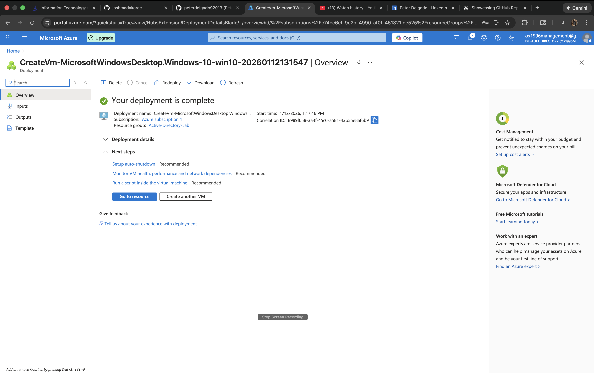
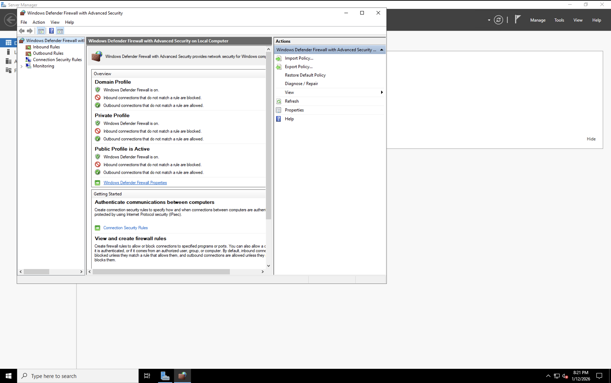
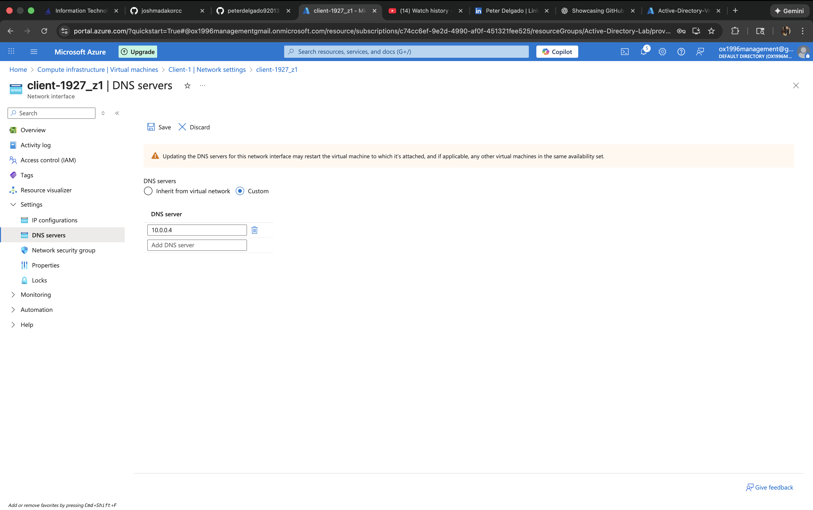
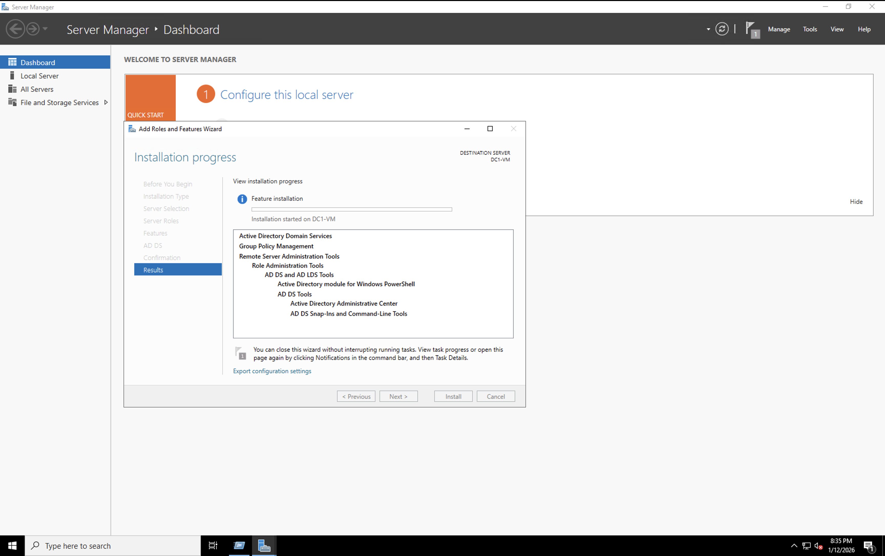
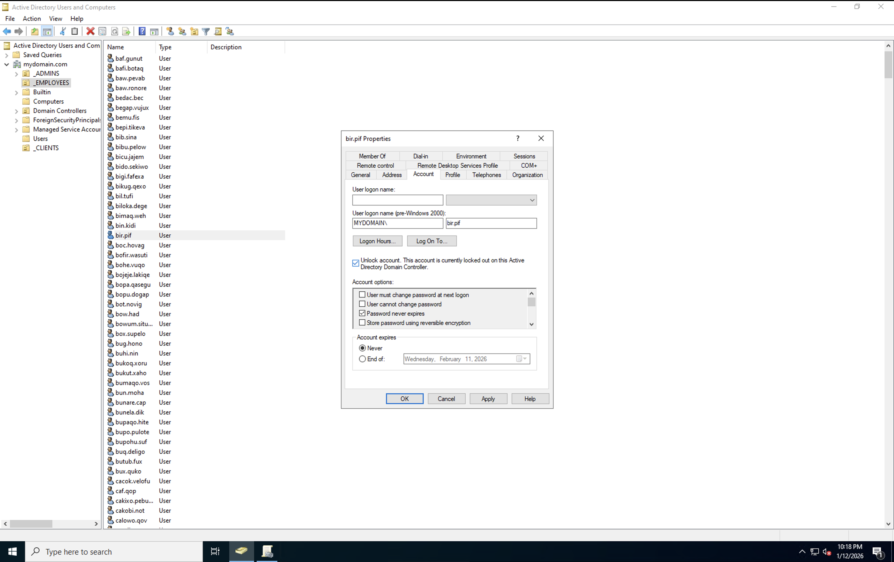

  

# Active Directory Domain Services Lab (Azure)

This project demonstrates deploying and configuring **Active Directory Domain Services (AD DS)** in **Microsoft Azure**, including virtual machine deployment, DNS configuration, connectivity validation, and core identity management tasks. The lab simulates real-world enterprise identity infrastructure using Windows Server and a Windows client VM.

---

## 🎥 Project Walkthrough Video

A full walkthrough video demonstrating the setup, configuration, verification, and troubleshooting steps performed in this project.

👉 **YouTube https://youtu.be/pn5dJ4kx_qg?si=Ua44oW5MNWzyvkvq

---

## 🧰 Technologies Used
- Microsoft Azure (Virtual Machines, Networking)
- Windows Server
- Windows Client (Windows 10/11)
- Active Directory Domain Services (AD DS)
- Windows Defender Firewall
- PowerShell
- Remote Desktop Protocol (RDP)

---

## 🖥️ Lab Environment
- **Domain Controller VM** — Windows Server
- **Client VM** — Windows 10/11
- Internal Azure Virtual Network using private IP communication

---

## 📸 Project Screenshots & Explanations

### 🟦 Part 1 — Azure VM & Domain Preparation

#### Azure VM Deployment Completed
This screenshot confirms the successful deployment of the Windows virtual machine in Microsoft Azure, serving as the foundation for the Active Directory lab.

---

#### Windows Firewall & Network Profile Verification
Verification of Windows Defender Firewall profiles to ensure the system is properly classified on the network before configuring domain services.

---

#### Client DNS Configuration (Pointing to Domain Controller)
The client virtual machine’s DNS settings are manually configured to point to the Domain Controller’s private IP address, which is required for domain authentication and name resolution.

---

#### Client VM Login / Portal Access
Successful login into the client virtual machine, confirming connectivity and access before further domain validation and testing.

---

### 🟩 Part 2 — Networking, Verification & Services

#### Network Connectivity Test (Ping Domain Controller)
The client VM successfully pings the Domain Controller’s private IP address, confirming internal network communication within the Azure virtual network.

---

#### DNS Verification Using PowerShell
Running `ipconfig /all` on the client VM to confirm DNS resolution is correctly configured and pointing to the Domain Controller.

---

#### Installing Active Directory Domain Services (AD DS)
Using Server Manager to add the Active Directory Domain Services role to the Windows Server VM as part of domain controller preparation.

---

#### Unlocking a Domain User Account
Demonstrates basic Active Directory administrative tasks by unlocking a user account, reflecting common real-world identity management scenarios.

---

## ✅ Skills Demonstrated
- Azure virtual machine deployment and management
- DNS dependency awareness in Active Directory environments
- Network connectivity validation using ICMP
- Active Directory Domain Services installation
- Client-to-domain communication troubleshooting
- PowerShell-based system verification
- Identity and access management fundamentals

---

## 💡 Notes
- VMs can be stopped in the Azure Portal when not in use to reduce costs.
- This lab reflects entry-level to junior systems administration and cloud support responsibilities.

---

## 📌 Next Steps
- Domain controller promotion
- Organizational Unit (OU) design
- Group Policy configuration
- User and group management automation
- File sharing and NTFS permissions

